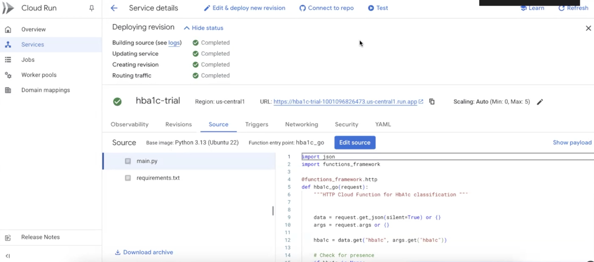
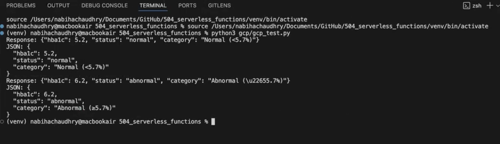
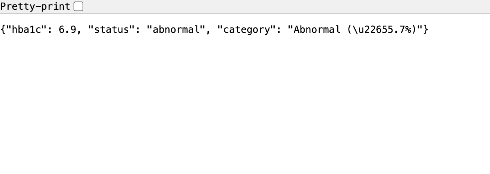
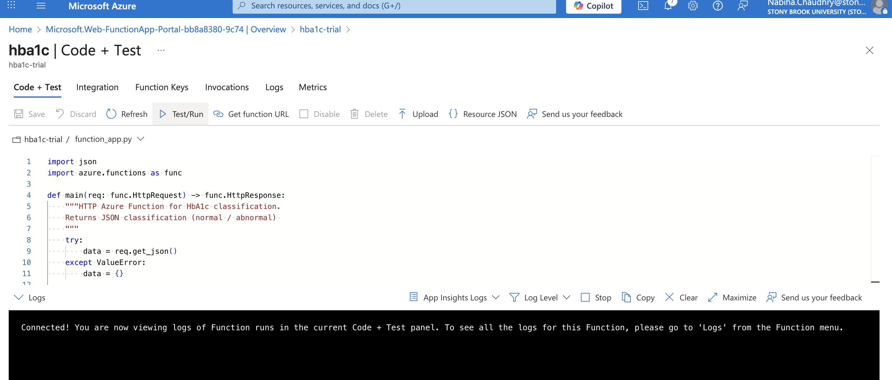
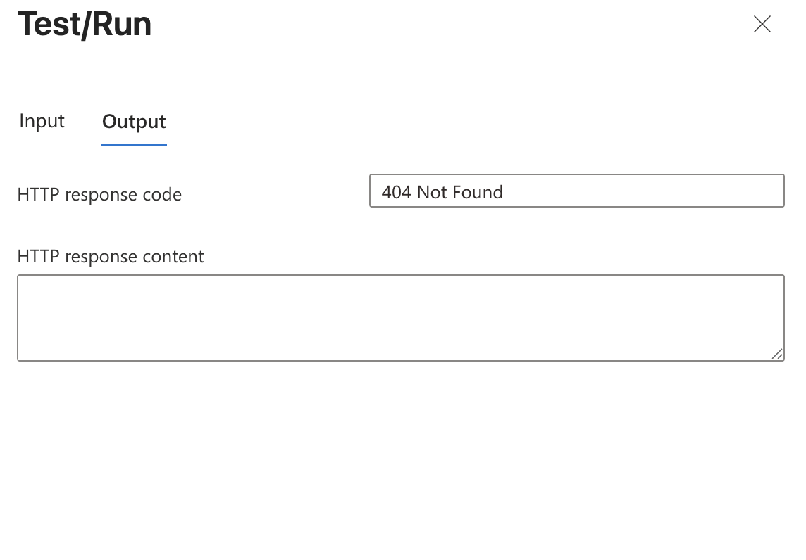

# AHI 504: Serverless Function Assignment: HbA1c 

## Hemoglobin A1c (HbA1c)  
**Classification Rule:**  
- **Normal:** HbA1c < 5.7%  
- **Abnormal:** HbA1c ≥ 5.7%  
  
### Source 
Centers for Disease Control and Prevention (CDC)  
[A1C Test for Diabetes and Prediabetes](https://www.cdc.gov/diabetes/diabetes-testing/prediabetes-a1c-test.html)

## Cloud Deployments
| Google Cloud Functions | us-central1 | `(https://hba1c-trial-1001096826473.us-central1.run.app)` 
| Microsoft Azure Functions | East US | `[(https://hba1c-trial-e4f8gmbddzaac5dm.eastus2-01.azurewebsites.net/api/hba1c?code=41yAD7eMYsRzZmG9PkEinPrEZbjyFSVXRo0O4am5oR0xAzFuTOi9og==)` 

## Recording
- [Watch here](https://drive.google.com/file/d/1dB-TA_ONqkGrTK51he8EIoWyZw6r0LKy/view?usp=drive_link)

## Google Cloud
- Service:

- Outputs:

## Azure
Errored:

## Cloud Comparison
Google Cloud Functions was straightforward to deploy, with a simple command and automatic public URL generation. It worked quickly and reliably, making testing easy. Azure Functions, on the other hand, gave me errors during deployment, and I struggled to get it working, so I wasn’t able to complete the Azure part for this assignment. If time allows, I would like to troubleshoot it further in the future. Overall, GCP felt faster and easier, while Azure has more features and better monitoring once it’s running.
